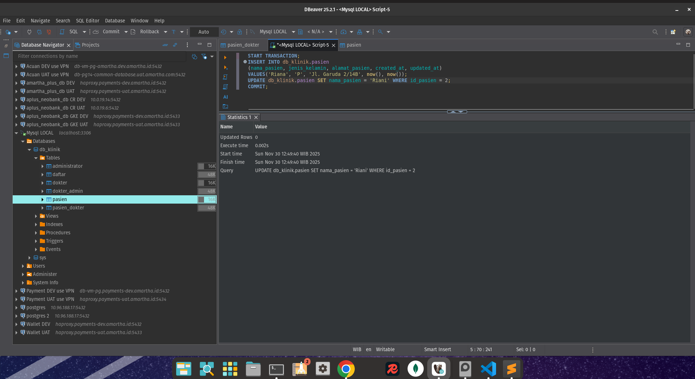
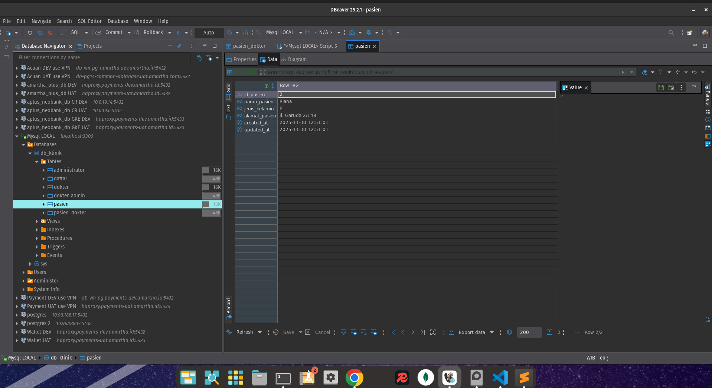
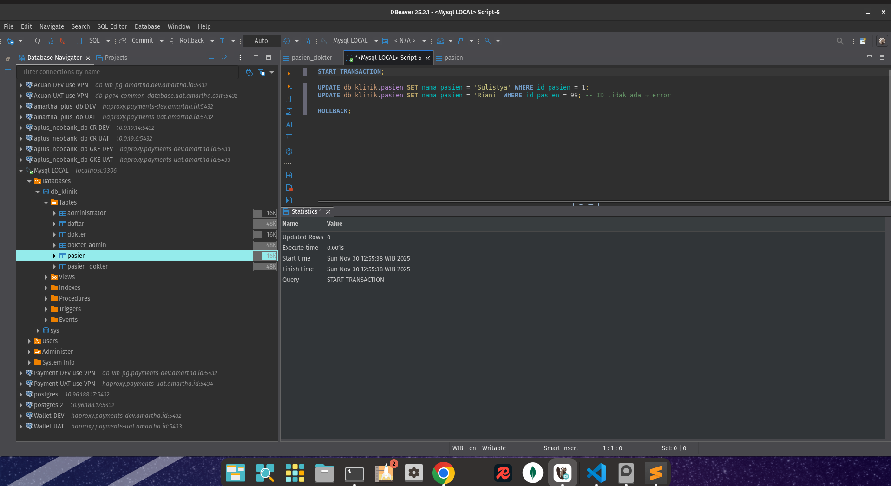
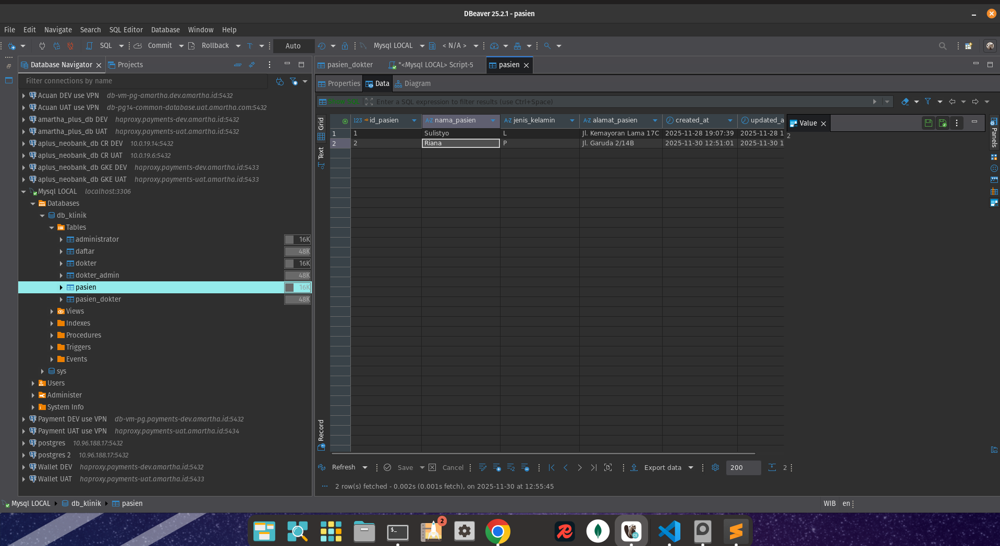
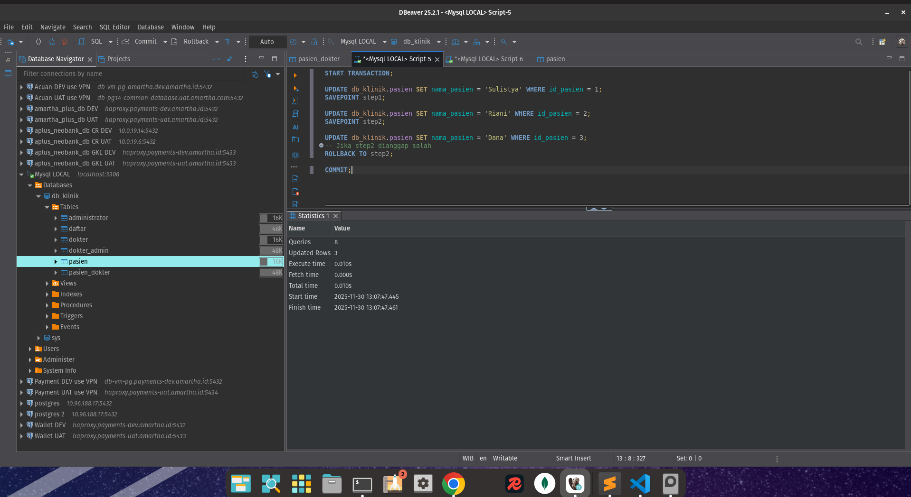
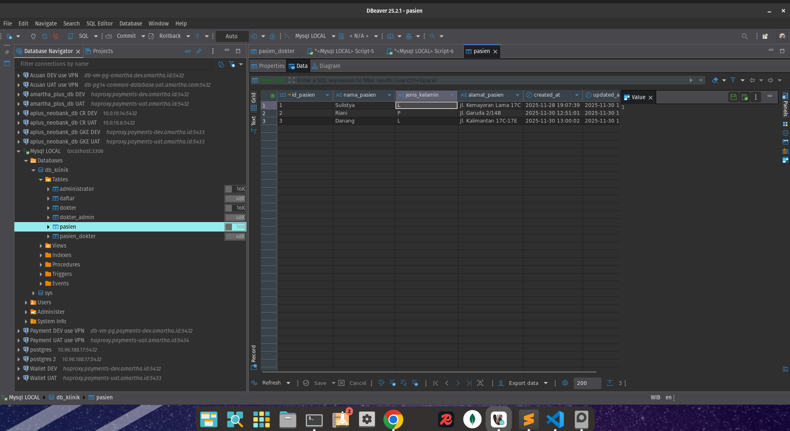
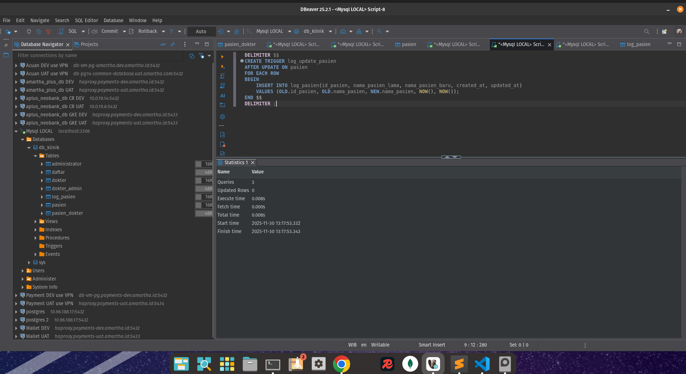
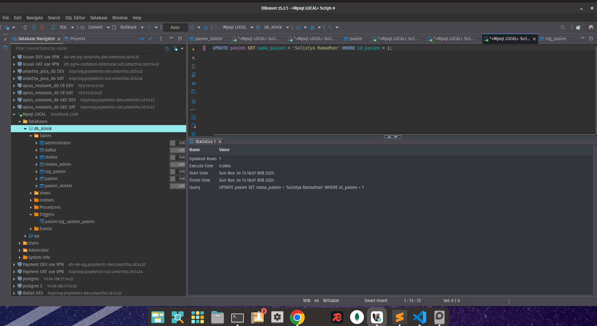
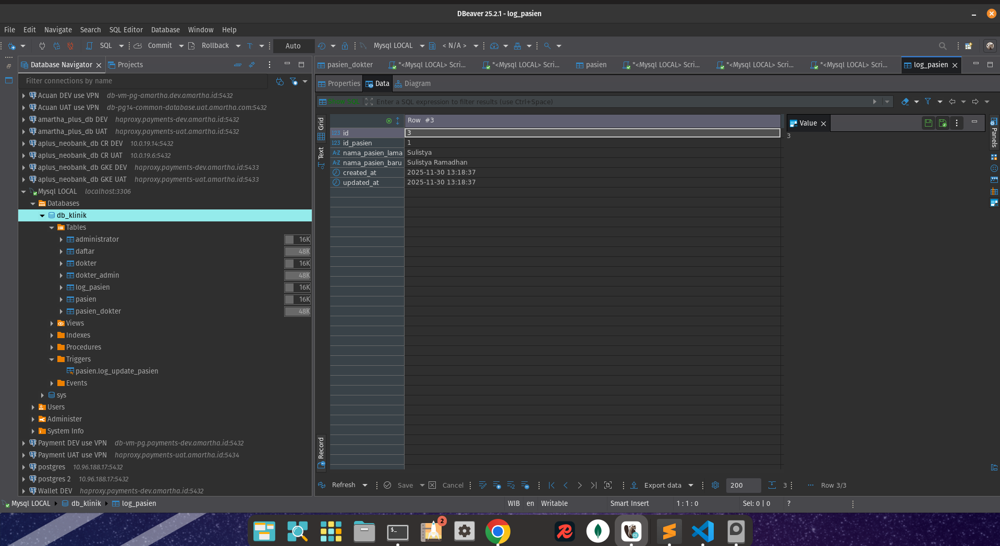

# StrukturData
mysql installation in local(use linux ubuntudistro environment): 
- sudo apt install mysql-server -y
- sudo systemctl start mysql
- sudo mysql
- mysql -u root -p
- CREATE USER 'namauser'@'localhost' IDENTIFIED BY 'passwordku';
- GRANT ALL PRIVILEGES ON *.* TO 'namauser'@'localhost' WITH GRANT OPTION;
- FLUSH PRIVILEGES;
- do run the migration.sql and backup.sql
- do run the transaction.sql

## Screenshot
### Commit

### Rollback

### Savepoint

### Trigger

